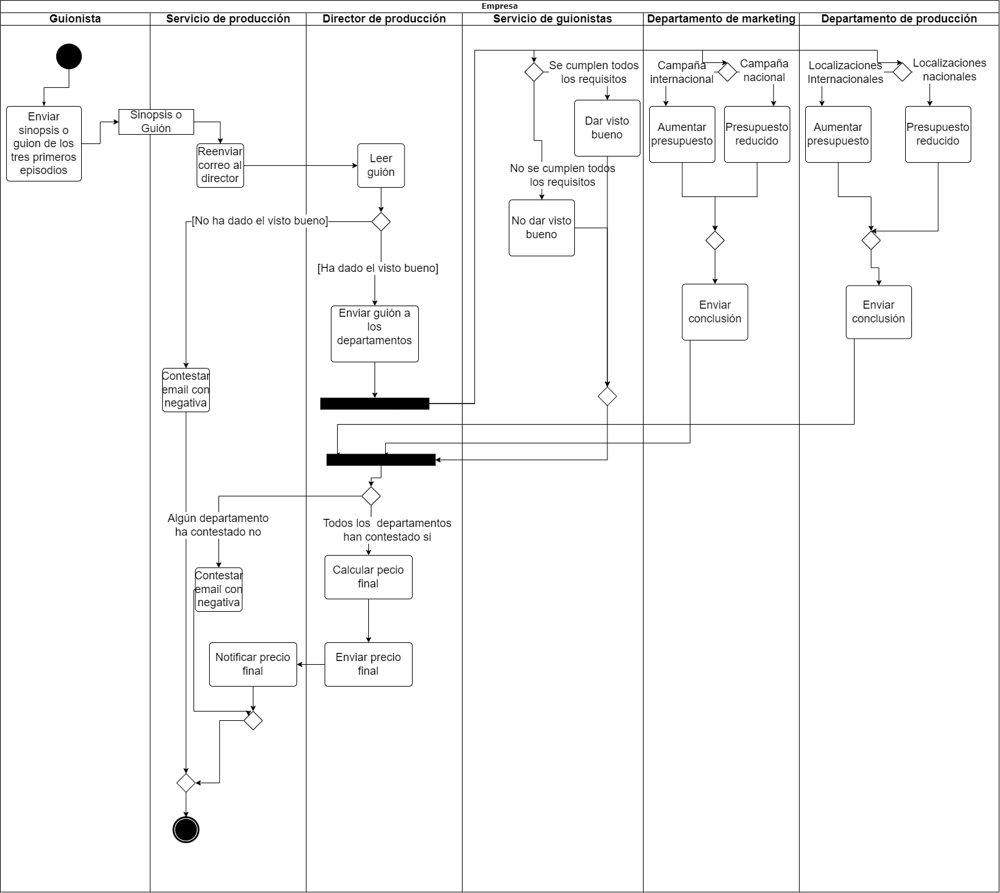

# Decision Optimization in the Entertainment Industry: Data Analytics and Process Modeling at Netflix.

## Introduction

In this project, I have deepened in the theoretical concepts related to data analysis and decision making. Throughout this process, I have applied my knowledge to design and build an information system to make informed decisions.

First, I focused on modeling the business process for deciding whether to produce a series, movie or not. I used UML and BPMN activity diagrams to visually represent this process and make it easier to understand. This model is not the one that would finally be applied but it shows what would be the process of selecting a film or series.

As a next step, I performed analysis of the raw data from the Netflix platform. I analyzed the consumption data of some users and created bar charts to present the information visually and facilitate decision making by executives.

In summary, throughout this personal project I have created an information system that integrates data analysis and decision making. I have applied the theoretical knowledge acquired to:

- Design and build a data warehouse.
- Manipulate data and perform analytical operations.
- Develop a Balanced Scorecard (BSC) to support business decision making.

This project has been an opportunity to autonomously apply the theoretical concepts learned and get a more practical view of their application in a business context.

## Process modeling

So far, I have started by modeling the business process I have been tasked with on this project. The business process focuses on the decision to produce a series or movie when a scriptwriter submits a proposal. To visualize and represent this process, I created a UML diagram that shows all the stages and the interactions between the different actors involved.

Here is the resulting UML diagram:

 

On the other hand, the resulting BPMN diagram is:

 

Both diagrams accurately captures the workflow and key activities necessary to evaluate the writer's proposal and make an informed decision. It provides a clear and concise view of the steps involved, from script review to financial evaluation and final decision making.

## MIS (Management Information System)

During this stage of the project, a first version of a management information system was developed. To achieve this, I obtained a .csv file provided by Kaggle containing data from different Netflix movies and series, which I had to transform to a format suitable for further processing using a high-level programming language.

In my case, I decided to work with Python using the pandas library, widely recognized and currently used for data analysis. To store the information efficiently, I chose to use SQLite3 as a database, since it offers all the necessary features to meet the requirements of the project, in addition to presenting ease of use and integration, as it is an embedded database. Finally, to create the graphics, I selected the matplotlib library.

### Creation of the Database

In the first phase, I focused on reading the data from the .csv files and storing them in the database. In the first phase, I focused on reading the data from the .csv files, and then storing it in the database. I had to take into account that some rows of the .csv file contained empty fields, so I had to indicate to the conversion function that, in these cases, the data would be stored in the database with the value NULL. To store this data, I created a table called "show" in the relational database. To read the data, I used the pandas read_csv function, which returned a pandas DataFrame that we later converted into a SQLite3 table using to_sql. In this way, we obtained our "show" table with all the data of the series and movies, located in the [TransactionalDatabase.db](https://github.com/pizarroiker/SI-P1/blob/master/DDBB/TransactionalDatabase.db)

In the context of this project, the most relevant data for a streaming platform like Netflix are those related to the viewing of the different contents. Since we did not have access to that real information, I had to simulate the viewing of several users in relation to the available content. This allowed me to perform a data analysis in the next step and test it with fictitious data before applying it to real user data.

To carry out this simulation, first, it was necessary to generate users using the [generateCsvUsers.py](https://github.com/pizarroiker/SI-P1/blob/master/Transaccional/CSV/generateCsvUsers.py) file and create a table in the database to store them, following the same process used for the Netflix CSV file. In this table, we store the user's ID, name, last login date and country. 

Once all the users were generated, I proceeded to randomly generate the users viewing data for the different contents. To accomplish this, I generate a csv with randomly generated data and manipulate some entries to try to simulate real data in the later phases( using [generateCsvViews.py](https://github.com/pizarroiker/SI-P1/blob/master/Transaccional/CSV/generateCsvViews.py)). Later I created the table in the database, this one includes the following fields: id (to identify the viewing), id_show (to identify the content viewed), id_user (to identify the user who viewed it), date (to identify when the view took place) and score (representing the rating given by the user to the content).

### Database queries and statistics

**FILE: **[Report](https://github.com/pizarroiker/SI-P1/blob/master/Transaccional/report.txt)

The first thing I did was to divide the shows table into a series of dataframes. The importance of this work lies in the organization's need to analyze and make decisions based on relevant and segmented information. For this, I classified the data into movies and series. Then, I grouped series by number of seasons and movies by length. This has made a certain section of the report much easier to perform. After doing this, the program will create an html report where we will show statistics of the show table and the dataframes mentioned above.

I performed several calculations to obtain relevant information about the data. First, I calculated the number of available samples, considering those entries that had no empty fields. In addition, I determined the maximum and minimum value of the launch year. I used the launch date as a reference and filtered out those empty fields to avoid problems with null values. This gave us a clear idea about the temporal distribution of the analyzed data. Continuing with the analysis, I focused on the duration values. For both movies and series, we performed specific calculations. I filtered out the null duration values as I considered that these values were not relevant and could affect the final results.

These calculations were implemented using SQL queries and we used functions from the pandas library to manipulate and process the data efficiently. These are the results reflected in the report:

| Query                     | Result                           | 
| ------------------------- | --------------------------------- | 
| Number of complete samples (without missing values)   | 5747   | 
| Average duration (Movies)      | 100 minutes       |
| Average duration (TV Shows) | 2 seasons  | 
| Standard deviation of duration (Movies) | 28.29   | 
| Standard deviation of duration (TV Shows) | 1.58   | 
| Maximum Movie duration | 312 minutes  | 
| Maximum TV show duration | 17 seasons   | 
| Minimum Movie duration | 3 minutes |
| Minimum TV show duration | 1 seasons  | 
| Most recent year of publication | 2021   | 
| Oldest year of publication | 1925 |

These results could provide the organization important information about the distribution and temporal range of the analyzed data, which allows us to move forward in the project with a better understanding of the situation.

Returning to the previous dataframes, we have performed on each one a series of operations to obtain statistical data for each one. As before, all these data have been compiled in the report. Tables with the results obtained are shown below.

#### Type of Content

| |Movies |
| --------------- | 
| Length | 6131   | 
| Null Values | 3      |
| Median | 98.0  | 
| Mean | 99.58   | 
| Var | 800.36  | 
| Maximum | 312.0 | 
| Minimum | 3.0   | 

| |TV Shows |
| -------------- | 
| Length | 2676   | 
| Null Values | 0   |
| Median | 1.0  | 
| Mean | 1.76   | 
| Var | 2.51  | 
| Maximum | 17 | 
| Minimum | 1   | 

