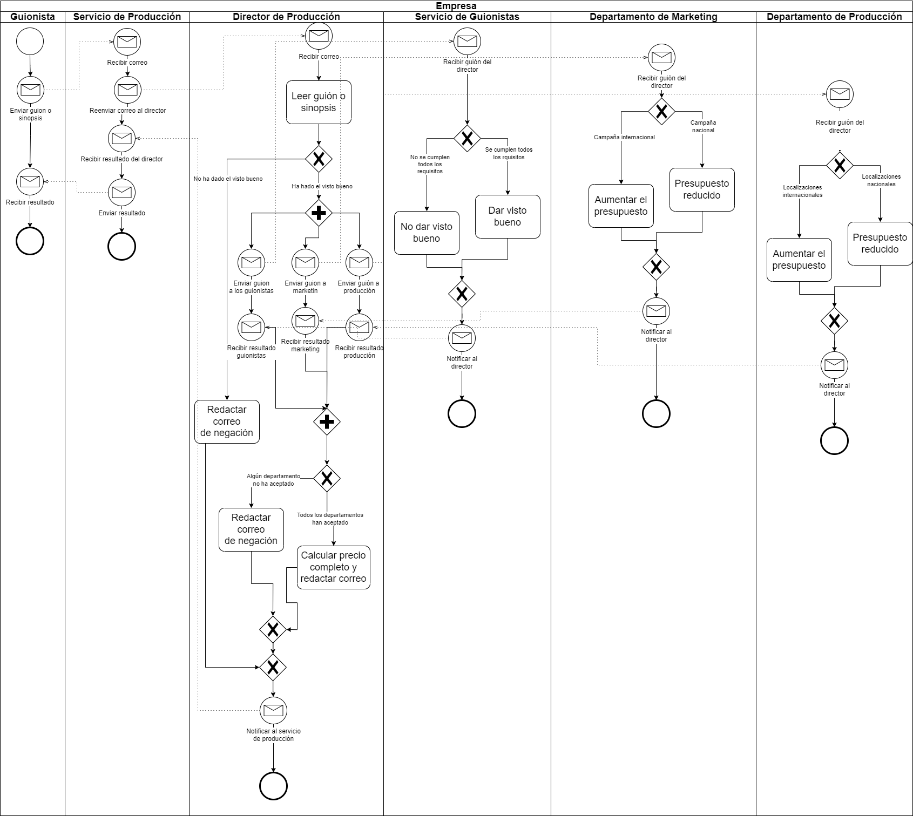

# Decision Optimization in the Entertainment Industry: Data Analysis and Process Modeling at Netflix.

## Introduction

In this project, I have deepened in the theoretical concepts related to data analysis and decision making. Throughout this process, I have applied my knowledge to design and build an information system to make informed decisions.

First, I focused on modeling the business process for deciding whether to produce a series, movie or not. I used UML and BPMN activity diagrams to visually represent this process and make it easier to understand. This model is not the one that would finally be applied but it shows what would be the process of selecting a film or series.

As a next step, I performed analysis of the raw data from the Netflix platform. I analyzed the consumption data of some users and created bar charts to present the information visually and facilitate decision making by executives.

In summary, throughout this personal project I have created an information system that integrates data analysis and decision making. I have applied the theoretical knowledge acquired to:

- Design and build a data warehouse.
- Manipulate data and perform analytical operations.
- Develop a Balanced Scorecard (BSC) to support business decision making.

This project has been an opportunity to autonomously apply the theoretical concepts learned and get a more practical view of their application in a business context.

## Process modeling

So far, I have started by modeling the business process I have been tasked with on this project. The business process focuses on the decision to produce a series or movie when a scriptwriter submits a proposal. To visualize and represent this process, I created a UML diagram that shows all the stages and the interactions between the different actors involved.

Here is the resulting UML diagram:

 

On the other hand, the resulting BPMN diagram is:

 

Both diagrams accurately captures the workflow and key activities necessary to evaluate the writer's proposal and make an informed decision. It provides a clear and concise view of the steps involved, from script review to financial evaluation and final decision making.

## MIS (Management Information System)

FILE: [TransactionalProcess](https://github.com/pizarroiker/SI-P1/blob/master/Transaccional/TransactionalProcess.py)

During this stage of the project, a first version of a management information system was developed. To achieve this, I obtained a .csv file provided by Kaggle containing data from different Netflix movies and series, which I had to transform to a format suitable for further processing using a high-level programming language.

In my case, I decided to work with Python using the pandas library, widely recognized and currently used for data analysis. To store the information efficiently, I chose to use SQLite3 as a database, since it offers all the necessary features to meet the requirements of the project, in addition to presenting ease of use and integration, as it is an embedded database. Finally, to create the graphics, I selected the matplotlib library.

### Creation of the Database

In the first phase, I focused on reading the data from the .csv files and storing them in the database. In the first phase, I focused on reading the data from the .csv files, and then storing it in the database. I had to take into account that some rows of the .csv file contained empty fields, so I had to indicate to the conversion function that, in these cases, the data would be stored in the database with the value NULL. To store this data, I created a table called "show" in the relational database. To read the data, I used the pandas read_csv function, which returned a pandas DataFrame that we later converted into a SQLite3 table using to_sql. In this way, we obtained our "show" table with all the data of the series and movies, located in the [TransactionalDatabase.db](https://github.com/pizarroiker/SI-P1/blob/master/DDBB/TransactionalDatabase.db)

In the context of this project, the most relevant data for a streaming platform like Netflix are those related to the viewing of the different contents. Since we did not have access to that real information, I had to simulate the viewing of several users in relation to the available content. This allowed me to perform a data analysis in the next step and test it with fictitious data before applying it to real user data.

To carry out this simulation, first, it was necessary to generate users using the [generateCsvUsers.py](https://github.com/pizarroiker/SI-P1/blob/master/Transaccional/CSV/generateCsvUsers.py) file and create a table in the database to store them, following the same process used for the Netflix CSV file. In this table, we store the user's ID, name, last login date and country. 

Once all the users were generated, I proceeded to randomly generate the users viewing data for the different contents. To accomplish this, I generate a csv with randomly generated data and manipulate some entries to try to simulate real data in the later phases( using [generateCsvViews.py](https://github.com/pizarroiker/SI-P1/blob/master/Transaccional/CSV/generateCsvViews.py)). Later I created the table in the database, this one includes the following fields: id (to identify the viewing), id_show (to identify the content viewed), id_user (to identify the user who viewed it), date (to identify when the view took place) and score (representing the rating given by the user to the content).

### Database queries and statistics

FILE: [Report](https://github.com/pizarroiker/SI-P1/blob/master/Transaccional/report.html)

The first thing I did was to divide the shows table into a series of dataframes. The importance of this work lies in the organization's need to analyze and make decisions based on relevant and segmented information. For this, I classified the data into movies and series. Then, I grouped series by number of seasons and movies by length. This has made a certain section of the report much easier to perform. After doing this, the program will create an html report where we will show statistics of the show table and the dataframes mentioned above.

I performed several calculations to obtain relevant information about the data. First, I calculated the number of available samples, considering those entries that had no empty fields. In addition, I determined the maximum and minimum value of the launch year. I used the launch date as a reference and filtered out those empty fields to avoid problems with null values. This gave us a clear idea about the temporal distribution of the analyzed data. Continuing with the analysis, I focused on the duration values. For both movies and series, we performed specific calculations. I filtered out the null duration values as I considered that these values were not relevant and could affect the final results.

These calculations were implemented using SQL queries and we used functions from the pandas library to manipulate and process the data efficiently. These are the results reflected in the report:

| Query                     | Result                           | 
| ------------------------- | --------------------------------- | 
| Number of complete samples (without missing values)   | 5747   | 
| Average duration (Movies)      | 100 minutes       |
| Average duration (TV Shows) | 2 seasons  | 
| Standard deviation of duration (Movies) | 28.29   | 
| Standard deviation of duration (TV Shows) | 1.58   | 
| Maximum Movie duration | 312 minutes  | 
| Maximum TV show duration | 17 seasons   | 
| Minimum Movie duration | 3 minutes |
| Minimum TV show duration | 1 seasons  | 
| Most recent year of publication | 2021   | 
| Oldest year of publication | 1925 |

Returning to the previous dataframes, we have performed on each one a series of operations to obtain statistical data for each one. As before, all these data have been compiled in the report. Tables with the results obtained are shown below.

#### Type of Content

| | Movies |              
| ------- | -------- |
| Length | 6131   |      
| Null Values | 3      |     
| Median | 98.0  |     
| Mean | 99.58   |   
| Var | 800.36  |  
| Maximum | 312.0 |   
| Minimum | 3.0   |   

| | TV Shows |
| ------- | ------- | 
| Length | 2676   | 
| Null Values | 0   |
| Median | 1.0  |
| Mean | 1.76   |
| Var | 2.51  |
| Maximum | 17 |
| Minimum | 1   | 

#### Type of Movie

| | Movies that are longer than 90 minutes or 90 minutes long |              
| ------- | -------- |
| Length | 4290   |          
| Median | 107.0  |     
| Mean | 112.45   |   
| Var | 434.69  |  
| Maximum | 312 |   
| Minimum | 90   |   

| | Movies that last less than 90 minutes |
| ------- | ------- | 
| Length | 1838   | 
| Median | 76.0  |
| Mean | 69.53   |
| Var | 364.24  |
| Maximum | 89 |
| Minimum | 3   | 

#### Type of TV Show

| | TV Shows that last more than 2 seasons |              
| ------- | -------- |
| Length | 458   |        
| Median | 4.0  |     
| Mean | 4.54   |   
| Var | 4.59 |  
| Maximum | 17 |   
| Minimum | 3 |   

| | TV Shows that last 2 seasons or less |
| ------- | ------- | 
| Length | 2218   | 
| Median | 1.0  |
| Mean | 1.19   |
| Var | 0.15  |
| Maximum | 2 |
| Minimum | 1   | 

These results could provide the organization important information about the distribution and temporal range of the analyzed data, which allows us to move forward in the project with a better understanding of the situation.

### Plots

At this stage of the project, I have recognized the importance of presenting the information in a visual and easily understandable way. To achieve this, I have chosen to use bar charts, which allow a clear and concise visualization of the data.

By using bar charts, we are prioritizing clarity and ease of understanding the data. This allows us to effectively communicate the results of the analysis and provide an overview of the most popular movies in terms of views.

One of the first graphs created is the top 10 most viewed movies. This bar chart shows in an orderly and hierarchical way the movies that have been most viewed, allowing us to quickly identify which are the most popular. This visual approach facilitates the interpretation of the information and helps most people to understand it in a simple way.

In line with our visual and comprehensible approach, we have extended the use of bar charts to represent the top 10 most viewed series. This new chart allows us to clearly and concisely visualize the most popular series in terms of number of views.

In the final stage of this analysis, I compared content by duration, focusing on movies. To do so, I calculated the average number of views for movies with a duration of more than 90 minutes and the average number of views for movies with a duration of less than 90 minutes.

I have done the same for TV Shows, comparing the average viewings of those with 2 or less seasons with those with more than 2 seasons.

## Data Warehouse

### Data warehouse Design

In this phase, I have explored the theoretical concepts related to the design of a data warehouse. I have followed a series of steps to establish the basis of my design:

First, I have selected the central fact for my data warehouse, which is "Visualizations". Later, I will define the measures associated with this fact.

Next, I have identified the dimensions needed to address the issues raised. I have found the following relevant dimensions: a temporal dimension (mandatory) that will provide information about when the visualizations were performed, a "Show" dimension that will provide details about the movies or series visualized, and a "User" dimension that will indicate who performed the visualizations. 

Then, I decided on the granularity for each of the dimensions. I have chosen to follow the atomic granularity in the "Show" dimension, as this will allow me to get all the information from the shows and present it in various forms. As for the "Time" dimension, I have decided to drill down only to months, considering that this information is sufficient for the tasks to be performed. Finally, in the "User" dimension, as in the "Item" dimension, I have opted for atomic granularity, including all user attributes.

To complete the design of my data warehouse, I must select the measures and attributes related to the core fact and dimensions. The core measures for the fact "Visualizations" will be the total number of visualizations performed and the average ratings of these. As for the attributes, in the dimension "Time" I have decided to include the attributes of year and month. On the other hand, the "Item" dimension will contain all the fields of the "shows" table of my transactional database, and the "User" dimension will contain all the fields of the "users" table.

Regarding the tables, I have considered the following:

First, the "Time" table can be created and filled in directly, since we know in advance its structure and the information it will contain. In this case, I have decided to count the visualizations made from the beginning of January 2018 to April 2023, covering a period of approximately 5 years.

On the other hand, the "Show" table will be identical to the "Shows" table in our transactional database, as it contains the relevant details of the movies or series viewed. Likewise, the "User" dimension will match the users table in our transactional database, as it provides information on who performed the views.

In addition, I have reflected on the need for external information for the development of our data warehouse. I came to the conclusion that, although it is advisable to use internal and external sources, in this case I do not require additional information beyond what I already have in our transactional database to address the questions posed.

As for the choice of approach, I have chosen to use ROLAP and have designed our data warehouse following a star model. Below, I present the warehouse design, where the text fields are represented as VARCHAR2, as that was the option selected for "String" in the modeling tool used. The rows marked with "P" indicate the primary keys, while those marked with "F" represent the foreign keys. The arrows used simply indicate association by foreign keys, without regard to cardinality or other specifics. It is important to note that this design is a preliminary representation of the warehouse in SQL format and may undergo modifications during the implementation process.

### Warehouse construction and ETLs

FILE: [Data Warehouse Construction and loading](https://github.com/pizarroiker/SI-P1/blob/master/DataWarehouse/createDW.py)

After having designed the warehouse, we start to transform all this to code. For this, we have created the file [createDW.py](https://github.com/pizarroiker/SI-P1/blob/master/DataWarehouse/createDW.py) which builds the file [DataWarehouse.db](https://github.com/pizarroiker/SI-P1/blob/master/DDBB/DataWarehouse.db) where our data warehouse will be. Each part of the code will be explained below to make each step understandable.

To begin with, I performed a series of imports: sqlite3 (to operate with the transactional database and the warehouse), pandas and datetime (to help us with data extraction, transformation and loading). I then connected to the two databases using "sqlite3.connect()". Then with these connections I have associated a cursor to each one to be able to perform SQL operations on them.

After connecting the databases, I proceeded to build the warehouse by creating the fact table and the dimension tables. To do this I used the warehouse cursor to run a "CREATE TABLE" for each table with the respective primary and foreign keys, and the dimensions and attributes specified in the design. As I explained before, the time table we know beforehand, so I proceeded to load it by giving each value (month,year) an autoincremental id, i.e. for January 2018 (1), February 2018 (2), ..., January 2019(13), etc.

Once our warehouse is created, it is time to perform the ETLs. Given this, I have collected in a dataframe the users table from the transactional and loaded it into the users table of the data warehouse using the function "df.to_sql". We have performed the same operation for the article table, extracting the shows table from the transactional database and loading it directly. We have to emphasize that I have been able to do this thanks to the fact that the names of the attributes of both tables were identical, and also to say that thanks to the "if exists=replace" in the case of rerunning the program, we have managed to replace all the table of the warehouse by the transactional table in case the data of this one will change and we had to redo the data load.

Finally, we still have to load the fact table. For this I have made a query to the table of visualizations. In this query I have done the following: group by the attributes (show_id, user_id, date), perform a COUNT of the times that are repeated (which we will save in the count measure), and an AVG of the ratings (which we will save in the avg_rating measure). After making a query, I have saved the information in a data frame but I have run into a problem. The problem is that "time_id" is obtained by a number based on the month and year, and what we have in the data frame is only the month and year. To solve this problem we have created the function "to_time_num" that we have applied to the data in the column "date" of the data frame. This function obtains a date in string, transforms it to a datetime object with which we obtain the month and the year, and based on this data we obtain the corresponding id and we assign it. After transforming the column data, I have replaced the column name in order to perform the load. Finally, I have performed the load in the same way as we have done in the items and users table. In this way, we would have our entire warehouse loaded. Note that the cells not filled in the warehouse will have a 0 as count and the average will be null and will not be taken into account when averaging several cells.

### Queries, algorithms and data mining

In the following section, I have performed a series of operations and algorithms to extract the information that will be represented in our CMI. For it I have designed a series of scripts in Python: 

- [getTopXShows.py](https://github.com/pizarroiker/SI-P1/blob/master/DataWarehouse/getTopXShows.py): In this script, we can interact with the terminal choosing the type of show and the number X of shows that we want to show the top, returning the corresponding top. For it, the user will have to introduce one of the two types ("TV Show" or "Movie") and the number, once introduced the program makes a Slice & Dice (We make a query in which we make a JOIN with the table "article" and when grouping only by the show_id, we make a Roll in the other two dimensions) on our data store saving it in a dataframe. Finally we print this data frame showing the position in the top, the title of the show and the number of visualizations that have been made on it.

- [getTopXShowsDuration.py](https://github.com/pizarroiker/SI-P1/blob/master/DataWarehouse/getTopXShowsDuration.py): In this script, we can interact with the terminal choosing the type of show, the number X of shows that we want to show the top and the duration by which we want to filter depending on the type of show, returning the corresponding top. To do this, the user will have to enter one of the two types ("TV Show" or "Movie") and the number, once entered, will ask for the duration depending on whether it is "Movie" (more than 90 minutes or less) or "TV Show" (1 season, 2 seasons and 3 or more seasons). After entering all the data, the program performs a Slice & Dice (We perform a query in which we do a JOIN with the table "show" and by grouping only by the show_id, we do a ROLL on the other two dimensions. The difference with the previous one is that we add the restriction of the duration by means of a WHERE) on our data store saving it in a dataframe. Finally we print this data frame showing the position in the top, the title of the show and the number of visualizations that have been made on it.

- [recommendationAlgorithm.py](https://github.com/pizarroiker/SI-P1/blob/master/DataWarehouse/recommendationAlgorithm.py): In this script, we can interact with the terminal choosing the user on which we want to make the recommendations and the number of recommendations that we want to obtain. After entering the user, the program returns a list with the titles of the movies that it recommends. To do this, we have done the following. First, we have made a Slice & Dice on our table of facts saving it in a dataframe, we have made the operation "Pivot" on the data frame to have the users in the rows, the shows in the columns and the average ratings in the cells inside the matrix. After having the data entered by console and the matrix of users created, we calculated the similarity between users by means of the distance by the cosine method. Finally, by means of the set of the closest users we have obtained the ids of the best rated shows that the user had not seen. After having the "show_ids" stored in a list, we performed a Slice & Dice on our warehouse to obtain the titles of the shows using these ids and display them on screen.

- [ShowsWekaFile.py](https://github.com/pizarroiker/SI-P1/blob/master/DataWarehouse/ShowsWekaFile.py): This script performs a query to the data warehouse, taking most of the show attributes (that will be used to classify in Weka), the number of visualizations of each show, and the average of ratings. Then, we will transform the data in order to create the corresponding Weka file, we have transformed each country and show genre into a binary column, so that it has a 0 if it does not belong to that country and a 1 if it does, and the same with each category (Anime, Drama, ..., Horror). This has been done in order to be able to declare that a show has several genres or several countries, since with nominal attributes it could not be done correctly. Once this was done, we classified the movies into "good", "mid" or "bad" based on the average and deleted the average so that the weka classification algorithm could calculate the classification tree by the show's own attributes, i.e. without knowing the average. After loading all the data, we dumped the data frame into an ".arff" file. Once we have the corresponding file, we have performed the following steps in Weka: 
    - After entering Weka, select the "Explorer" option in the "Applications" section.
    - Once in the "Preprocess" tab, we open the ".arff" file from "Open File". After opening the file we go to the "Classify" tab.
    - Select in "Classifier" the option "Trees" and "J48". Check the option "Use training set" and click "Start". After that, a report will appear on the right side with the confusion matrix showing the accuracy and correctness, and the report containing relevant data about our classifier tree.

Finally, this tree could be used to classify new movies into good, mid and bad, and use this knowledge to determine how a user is based on the content he watches, use this in the recommendation algorithm, apply the good movies in a list to show in the main application, etc. As we have seen there are a lot of applications, but after trying several of them, due to complexity issues we have decided not to implement them, although they can always be incorporated in future versions after meeting with stakeholders.

## Balanced Scorecard (BSC)

In this section, I will present a non-functional version of the design for my BSC that can be used by senior executives to make decisions based on the top-viewed shows, recommend specific shows to users based on their similarity to other users, and provide rankings for both shows and users. As mentioned in the previous section, the user ranking has not been implemented yet, but we believe it is beneficial to include it in the CMI design as a proposal for future versions and to receive feedback from stakeholders. Below is an image depicting the design of the BSC:

Note: The image provided represents a preliminary design and may undergo modifications during the implementation process. It serves as a visual representation of the proposed CMI layout and functionality, allowing executives to effectively analyze and make informed decisions based on the provided information.

I have decided to divide the BSC into three parts: 

- On the left side of the design, there is the section where the "Top Most Viewed" will be displayed, based on the filters that can be selected. These filters include:

    - Program type selection: Users will be able to choose the type of program (e.g. movies, series) for which they wish to see the top most viewed.
    
    - Number of items in the top: Users will be able to specify the maximum number of items they wish to see in the top.
    
    - Duration filter: Depending on the type of program selected, users will have the possibility to filter the results by duration (e.g., display only programs with a duration of less than 2 seasons).
    
  Once the filters are selected, a table will be displayed containing the number of each item, its cover, its title and the number of views the program has received. I believe that the "Top Most Viewed" will be a highly visited section in our Balanced Scorecard (BSC). Therefore, following the design advice of the BSC, we have decided to place this section on the left side of the design, so that senior management can easily access this functionality and quickly get the information they want. 
  
- At the top right of our design, there is the section where the recommendation algorithm will be displayed. Here, users will have the option to select a specific user and the maximum number of programs (with a limit of 10 items) they wish to receive as a recommendation. Once the parameters have been selected, a table will be displayed containing the number of each item, its cover page and its title. We have decided to place this section next to the next one on the right side of the design, as they are related to each other. For example, the ranking algorithms implemented can be used later to improve or customize the recommendation algorithm. By linking these two sections in the design, we make it easier for users to explore and understand the different functionalities related to program recommendation.

- At the bottom right of our design, there is the section where Weka's classification of TV programs will be displayed. In this section, users will have the option to select what type of items they want to rate: programs (good, regular or bad) or users (part not implemented). This will be followed by a pie chart and a series of statistics indicating the accuracy of the classification, as well as the total number of items classified correctly and incorrectly. To represent the different types of programs, we use traffic light colors (green for good, yellow for fair and red for bad). In this way, people using the Balanced Scorecard (BSC) can quickly familiarize themselves with the classification and locate the different types of programs.

## Conclusion

During the course of this project, I have realized the immense value that information systems hold in today's business landscape. One aspect that particularly stood out to me was analyzing user viewing data, as it is a service widely used by platforms like Netflix, HBO, Disney+, and more. It was fascinating to see how theoretical concepts can be applied to a practical project, allowing me to gain a deeper understanding of their real-world implications. Additionally, I found working with technologies like pandas, SQL and Python to be immensely gratifying, as it is a widely used tool in the professional field that I hadn't had the opportunity to work with before.

Moreover, this project has provided me with a firsthand experience of the significant advantages that data warehouses offer compared to transactional databases. I have witnessed how data access times can be reduced, and the complexity of the underlying transactional database can be simplified through the implementation of data warehouses. The data mining aspect, where I worked with recommendation algorithms and experimented with tools like Weka, was particularly enjoyable.

Lastly, I want to emphasize the importance of generating these types of reports within organizations. They play a crucial role in facilitating well-informed decision-making processes, contributing to the growth and competitive advantage of the company within the industry. Overall, I consider this project to be incredibly valuable and enriching for both my professional development and the success of our organization.
